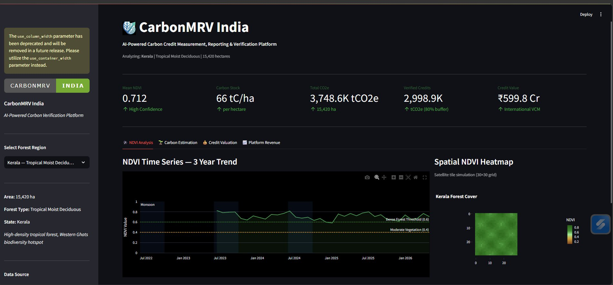
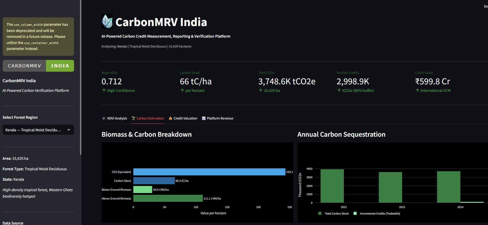
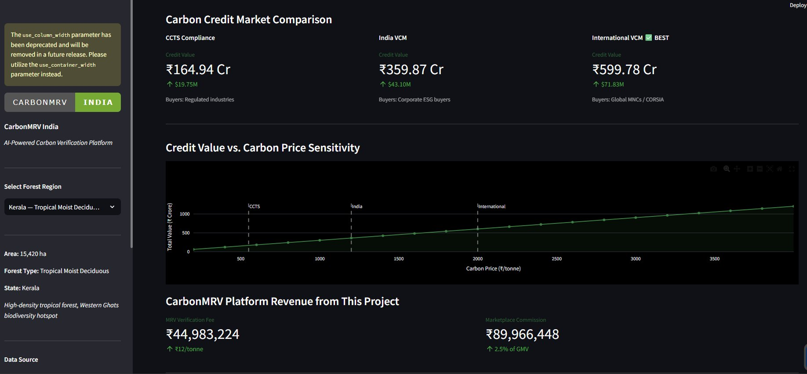
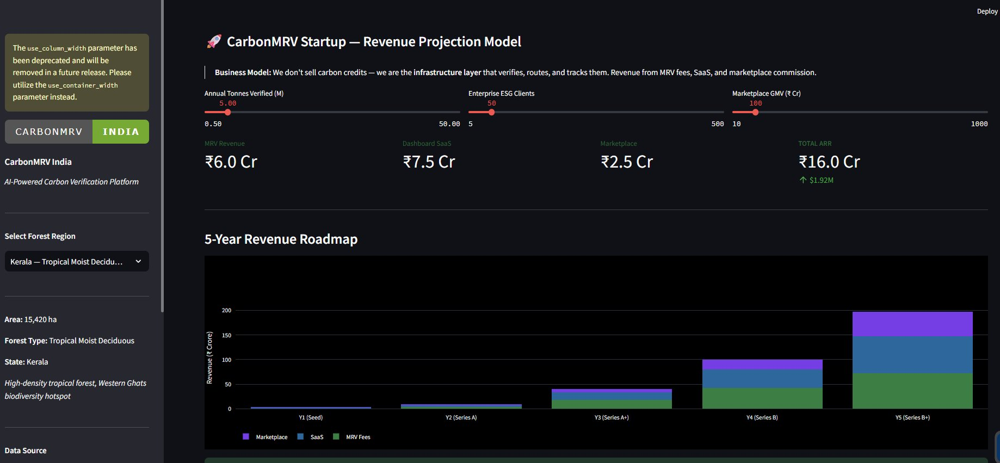

# 🌿 CarbonMRV India — AI-Powered Carbon Credit Verification Platform

> Automating Measurement, Reporting & Verification (MRV) of carbon credits using satellite imagery, NDVI analysis, and AI — built for India's Carbon Credit Trading Scheme (CCTS).


---

## 🚨 The Problem

India's Carbon Credit Trading Scheme (CCTS) went live in 2023. Every Nifty 500 company faces net-zero mandates. Yet:

- Manual MRV takes **6–18 months** per project
- **Double-counting** of credits is rampant
- Farmers and rural project developers have **zero access** to markets
- Corporate ESG teams are **flying blind** without reliable data

**Result:** Billions in legitimate carbon value go unverified, untraded, and wasted.

---

## 💡 The Solution

**CarbonMRV India** automates the entire verification pipeline:

```
Satellite Data (Sentinel-2 / ISRO)
        ↓
NDVI + Biomass Analysis (AI)
        ↓
Carbon Density Estimation
        ↓
Credit Issuance Recommendation
        ↓
Corporate Buyer Dashboard
```

What takes 18 months manually → **done in hours**.

---

## 🏗️ Architecture

```
carbon-mrv-india/
├── src/
│   ├── satellite_data.py       # Satellite data ingestion (GEE/Sentinel)
│   ├── carbon_calculator.py    # NDVI → Biomass → Carbon estimation
│   ├── credit_estimator.py     # Carbon tonne → Credit value
│   └── visualizer.py           # Maps, charts, heatmaps
├── dashboard/
│   └── app.py                  # Streamlit MRV Dashboard
├── notebooks/
│   └── carbon_mrv_analysis.ipynb   # Full analysis walkthrough
├── data/
│   └── india_forest_regions.json   # Sample regions (Western Ghats, NE India)
└── docs/
│   ├── methodology.md              # Scientific methodology & references
│   └── screenshots/
│       ├── ndvi-analysis.png
│       ├── carbon-estimation.png
│       ├── credit-valuation.png
│       └── revenue-projection.png         
```

---

## 🚀 Quick Start

```bash
# 1. Clone the repo
git clone https://github.com/subhadeep414/carbon-mrv-india.git
cd carbon-mrv-india

# 2. Install dependencies
pip install -r requirements.txt

# 3. Run the dashboard
streamlit run dashboard/app.py

# 4. Or run the core analysis
python src/carbon_calculator.py
```

---

## 📸 Dashboard Preview

### NDVI Analysis — Vegetation Health Monitoring
3-year NDVI time series alongside a spatial NDVI heatmap, with mean NDVI, carbon stock, total CO2e, verified credits, and credit value summarized at a glance.



### Carbon Estimation — Biomass & Sequestration Breakdown
Above/below-ground biomass, carbon stock, and CO2 equivalent per hectare, plus a multi-year view of total carbon stock vs. incremental tradeable credits.



### Credit Valuation — Market Comparison & Pricing Sensitivity
Side-by-side credit value across CCTS Compliance, India VCM, and International VCM, with a carbon price sensitivity curve and platform revenue (MRV fee + marketplace commission) for the project.



### Revenue Projection Model — Startup Economics
Interactive sliders for annual tonnes verified, enterprise ESG clients, and marketplace GMV, driving a 5-year revenue roadmap split across MRV fees, SaaS, and marketplace commission.



---

## 📊 Key Features

| Feature | Status |
|---|---|
| NDVI-based forest carbon estimation | ✅ Live |
| Multi-region India forest analysis | ✅ Live |
| Carbon credit value calculator | ✅ Live |
| Interactive Streamlit dashboard | ✅ Live |
| Sentinel-2 API integration | 🔄 In Progress |
| Google Earth Engine pipeline | 🔄 In Progress |
| On-chain credit registry (Polygon) | 📋 Planned |
| Corporate ESG reporting module | 📋 Planned |

---

## 🌍 India Regions Covered

- Western Ghats (Kerala, Karnataka)
- Northeast India (Assam, Meghalaya)
- Central Forests (Madhya Pradesh)
- Himalayan Foothills (Uttarakhand)

---

## ⚠️ Data Disclaimer
NDVI values are simulated to demonstrate the pipeline.
Production version connects to real Sentinel-2 / GEE data.
Carbon estimates follow IPCC Tier 2 methodology with
approximate India BCFs pending FSI field validation.

---

## 📈 Market Context

- India CCTS market: **₹50,000 crore** opportunity
- Voluntary carbon market demand from Indian corporates: **50M+ tonnes/year**
- BRSR reporting now **mandatory** for top 1000 listed companies
- India historical carbon credit supply: **900M+ CERs** under CDM

---

## 🔬 Methodology

Carbon estimation follows the **IPCC Tier 2 methodology**:

```
Carbon Stock = NDVI × Biomass Conversion Factor × Carbon Fraction
```

Full methodology in [`docs/methodology.md`](docs/methodology.md)

---

## 🛣️ Roadmap

### Phase 1 — MRV Engine (Current)
- [x] Satellite data pipeline
- [x] NDVI carbon estimation
- [x] Dashboard prototype
- [ ] Real GEE API integration
- [ ] Accuracy validation against field data

### Phase 2 — Market Layer (Q3 2025)
- [ ] Corporate buyer onboarding
- [ ] Project developer portal
- [ ] API for third-party verifiers

### Phase 3 — Registry (Q4 2025)
- [ ] On-chain credit issuance
- [ ] CCTS registry integration
- [ ] Automated audit trail

---

## 🤝 Contributing

PRs welcome. Open an issue first for major changes.

---

## 📄 License

MIT License — see [LICENSE](LICENSE)

---

## 👤 Author

Built as part of research into India's carbon market infrastructure.  
Thesis: *AI-native MRV is the missing layer for India's carbon credit ecosystem.*

---

*"The carbon market doesn't have a supply problem. It has a trust problem. We're fixing the trust layer."*
